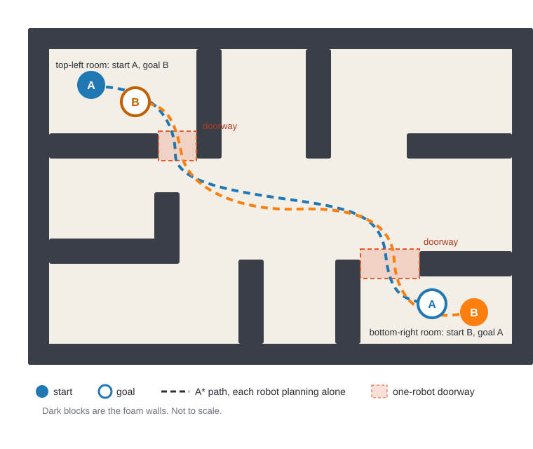

# Lab 1 — Getting Set Up, and Meeting the Problem

Welcome to COMP0182. This first session has three jobs: get you into a group with a working ROS 2 environment, introduce you to the robot you will be using all term, and show you the problem the rest of the module exists to solve.

Nothing here is assessed, no prior ROS 2 experience is assumed, and there is nothing you need to do before the session. Take the time to get your setup right — every later lab depends on it.

---

## The goal for this lab session

- [ ] A group of 3–4, and access to your group's lab miniPC
- [ ] A working ROS 2 Humble environment on your group's lab miniPC
- [ ] A verified install — you have seen two ROS 2 nodes talk to each other
- [ ] SSH access to a TurtleBot3, with bringup and teleop working
- [ ] Notes on the two-robot demo: what went wrong, and why

By the end of the lab you should be able to:

1. Explain in plain language what ROS 2 is and what problem it solves.
2. Point at any component on a TurtleBot3 Burger and say what it does.
3. Bring up a real robot over SSH and drive it.
4. Describe what goes wrong when two robots plan their paths independently.

Some of the words in that list — *node*, *bringup*, *teleop* — are probably new. [Section 2.2](#22-the-vocabulary-you-need-today) defines them. You are not expected to arrive knowing them.

---

## 1. Groups and hardware

### 1.1 Your group

You will work in groups of 3–4 for the whole module.

- Your group stays the same across all labs and the final challenge.
- Make sure **everyone** in the group can bring up and drive a robot themselves, even if you split tasks between group members.

Groups are finalised together in the first session, so there is nothing to arrange in advance. It goes faster if you arrive with a group of three or four already agreed between yourselves — but if you turn up on your own, you will be placed in a group on the day.

### 1.2 Your group's lab miniPC

Each group works on a shared miniPC, collected at the start of every session from our lab technician, **Bonot Gautam**. It already has **Ubuntu 22.04**, **ROS 2 Humble** and the TurtleBot3 packages installed system-wide, so there is nothing to install on it. Everything in this module can be done entirely on this machine.

- Keep your group's work in your own group's folder on the machine. It stays there between sessions.
- If you need extra software installed, ask Bonot to approve it first — don't install it yourself.

### 1.3 The robots

You will be using the **TurtleBot3 Burger**. If you go looking for documentation, check you are reading the Burger pages. There are different robot models with different dimensions.

The robots are already assembled, flashed and configured. You will not be building one from scratch.

Collect your group's robot from Bonot at the start of each session, and return it to him at the end. If you want to work with a robot outside a scheduled lab session, book it with him in advance.

---

## 2. What is ROS 2?

### 2.1 The problem it solves

A robot is not one program. It is a dozen small programs running at once: something reading the LiDAR, something estimating where the robot is, something planning a path, something driving the motors. They all need to exchange data, they all start and stop at different times, and some of them run on different computers.

This is what ROS 2 is for. In the words of the ROS documentation:

> The Robot Operating System (ROS) is a set of software libraries and tools for building robot applications. From drivers and state-of-the-art algorithms to powerful developer tools, ROS has the open source tools you need for your next robotics project.

In practice, that means a standard way for those dozen small programs to find each other and pass messages around, plus a large ecosystem of drivers, algorithms and tools you don't have to write yourself.

It helps to be clear about what ROS 2 is **not**:

- It is not an operating system. It runs on top of Linux.
- It is not a programming language. You will write normal Python and C++.
- It is not a robot controller or a navigation algorithm. It is what those things plug into.

Why it matters for this module: the same code can run against a simulated robot and a real one, and — with some care — against two robots instead of one.

### 2.2 The vocabulary you need today

Enough to follow along. Each of these gets proper treatment later.

| Term | What it means | Covered properly in |
|---|---|---|
| **Node** | One program doing one job | Lab 1–2 |
| **Topic** | A named stream of data that nodes publish to and read from | Lab 1–2 |
| **Message** | The structure of the data on a topic | Lab 1–2 |
| **Publisher / Subscriber** | Who writes to a topic / who reads from it | Lab 1–2 |
| **Parameter** | A configuration value belonging to a node | Lab 2 |
| **Launch file** | Starts and configures many nodes at once | Lab 2 |
| **Service / Action** | Request–response / a long-running goal you can track and cancel | Lab 2 |
| **TF / frames** | Where things are, relative to each other | Lab 3 |
| **Odometry** | The robot's own estimate of how far it has travelled, worked out from its wheels | Lab 3, Lab 4 |
| **SLAM** | Building a map of a space while working out where you are in it | Lab 5 |
| **Bringup** | The one command that starts every node the robot needs | Lab 1, Lab 3 |
| **Teleop** | Driving the robot by hand, from your keyboard | Lab 1 |
| **Workspace** | A folder you build your own ROS 2 packages in | Lab 1 exercise, Lab 4 |
| **Sourcing** | Telling a terminal where ROS 2 and your workspace live, so `ros2` works in it | Lab 1 |
| **`ROS_DOMAIN_ID`** | The number that decides which other nodes on the network yours can see | Lab 1 |

A useful mental picture: nodes are programs, topics are the wires between them, and together they form what ROS 2 calls the **computation graph** — the whole set of running nodes and the topics connecting them.

If you have used MQTT, topics will feel familiar: a named channel, publishers at one end, subscribers at the other. One difference matters. MQTT has a broker in the middle that everything connects to; ROS 2 has no broker. Nodes announce themselves on the network and find each other directly — which is why none of today's commands will ask you for the robot's address, and why nodes running on the miniPC and nodes running on the robot are simply one system. It also means that, by default, every ROS 2 node on the network can see every other one. You will come back to that in [Section 4.2](#42-set-your-ros_domain_id).

### 2.3 Why Humble specifically

We use **ROS 2 Humble**, the long-term-support release that pairs with Ubuntu 22.04 and with the TurtleBot3 packages we rely on.

Distro, OS version and robot packages have to match. Most "it works on my machine" problems in robotics come from mixing them.

Since Ubuntu 18.04, each Ubuntu LTS release has been paired with a matching long-term-support ROS 2 distro: Dashing with 18.04, Foxy with 20.04, Humble with 22.04, Jazzy with 24.04, and now Lyrical with 26.04. In practice: match your ROS 2 distro to your Ubuntu LTS, and expect the pair to move together roughly every two years.

Humble itself stays supported until May 2027.

### 2.4 Commands to get familiar with

You will use these constantly, starting today:

- `ros2 node list` — what is running
- `ros2 topic list` — what data is available
- `ros2 topic echo <topic>` — look at the data
- `ros2 topic hz <topic>` — is it arriving, and how fast
- `ros2 run` / `ros2 launch` — start one node / start a whole set of them

You will use all of these on a live graph in [Section 4.3](#43-the-fundamentals-exercise).

---

## 3. The TurtleBot3 Burger

### 3.1 What it is

TurtleBot is a standardised robotic platform developed for ROS education and research — the standard platform people learn ROS on, and one of the most widely used robotics platforms among developers and students worldwide.

Several versions of TurtleBot exist (TurtleBot1, TurtleBot2, TurtleBot3, TurtleBot4), developed by different teams over the years. We use **TurtleBot3**, specifically the **Burger** model.

TurtleBot3 is a small, affordable and customisable ROS-based mobile robot, built to be a low-cost, flexible development platform without sacrificing functionality — modular enough to be extended with different mechanical and electronic components, while its core capabilities (SLAM, navigation, manipulation) make it suitable for research.

It is a good fit for this module for the same reasons: small enough to run several in one arena, running the full ROS 2 navigation stack, and exhibiting all the awkward real-world behaviour — wheel slip, sensor noise, flat batteries — that simulation hides from you.

To see more about its features, check out the docs here: https://docs.robotis.com/docs/systems/turtlebot3/features

### 3.2 Know your robot's numbers

Fill this table in during the session and keep it. You will need these numbers later, when you are sizing a grid for planning and deciding how close two robots may safely get.

Most of it comes from the [TurtleBot3 e-Manual's specifications table](https://docs.robotis.com/docs/systems/turtlebot3/features#specifications) — check you are reading the **Burger** column, not the Waffle Pi one. The LiDAR rows are on the [LDS-02 page](https://docs.robotis.com/docs/systems/turtlebot3/more_info/lds_02) instead.

Two rows are not published in either table: **wheel radius** and **wheel separation**. You have the robot in front of you, so measure them — wheel separation meaning the distance between the two wheels' centre planes, from the middle of one tyre to the middle of the other, not between their outer faces. Note how precisely you can — Labs 3 and 4 are built on the fact that the robot's own sense of how far it has travelled is computed from exactly these two numbers.

| Property | Value | Where you will need it |
|---|---|---|
| Footprint (L × W) | | Grid cell size, collision radius |
| Height | | Where the LiDAR plane sits |
| Mass | | Stopping distance — it does not stop the instant you let go of the key |
| Wheel radius | | Odometry |
| Wheel separation | | Differential-drive kinematics |
| Max linear velocity | | How long a plan takes to execute |
| Max angular velocity | | The cost of turning on the spot |
| LiDAR range (min / max) | | Limits of SLAM and localisation |
| LiDAR scan rate / field of view | | Map quality |
| Battery capacity / runtime | | Planning your lab sessions |

One thing to think about once the table is full: the robot is not a point. What radius would you actually have to keep clear around it for a path to be safe?

### 3.3 A tour of the chassis

Work bottom to top:

- **Waffle plates and standoffs** — the frame everything bolts to.
- **Two DYNAMIXEL XL430 servos** — the driven wheels. They are closed-loop and report their own position and velocity, which is where wheel odometry comes from.
- **Wheels and caster** — differential drive: the robot steers by driving the two wheels at different speeds. The caster just holds the back up, and it is a quiet source of odometry error.
- **OpenCR 1.0 board** — the microcontroller. Drives the motors, carries the IMU, manages power, and handles the low-level safety behaviour.
- **IMU** (on the OpenCR) — measures rotation and acceleration; fused with wheel odometry to estimate motion.
- **Raspberry Pi** — the robot's computer. Runs ROS 2, talks to the OpenCR over USB and to your machine over Wi-Fi.
- **LiDAR (LDS-02)** — a spinning 2D laser scanner. It sweeps a single horizontal plane, so anything below or above that height is invisible to it. This is the sensor SLAM and navigation are built on.
- **LiPo battery and power switch** — handling and charging are covered in the session.

### 3.4 What has already been set up for you

Every robot has already had the **Hardware Assembly**, **OpenCR Setup**, and [**SBC Setup**](https://docs.robotis.com/docs/systems/turtlebot3/quick_start_guide/sbc_setup) steps from the TurtleBot3 e-Manual's Quick Start Guide done for it — the chassis is built, the OpenCR board has matching firmware flashed, and the Raspberry Pi is imaged with ROS 2 Humble and the TurtleBot3 packages. You do not have to repeat any of it. One thing it does *not* set is `TURTLEBOT3_MODEL` — you set that yourself each session, which is why it appears at the top of [Section 5.3](#53-start-the-robot-up-bringup).

The remaining step in that guide, **PC Setup**, only applies if you want ROS 2 on a machine of your own — see [Section 4.4](#44-optional-ros-2-on-your-own-machine). It is not needed for the lab.

---

## 4. Setting up your environment

Your group's lab miniPC **is** the environment for this module. It already has Ubuntu 22.04, ROS 2 Humble and the TurtleBot3 packages on it, and the robots are configured to match. There is nothing to install today.

Log in to your group's machine (see [Section 1.2](#12-your-groups-lab-minipc)) and work through the checks below.

If you also want ROS 2 on your own machine, see [Section 4.4](#44-optional-ros-2-on-your-own-machine) — but do that in your own time. It is a convenience, not a requirement, and you will not be at a disadvantage without it.

### 4.1 Check your environment works

Open a terminal and run:

```bash
printenv ROS_DISTRO
```

You should get `humble`. Nothing printed means this terminal hasn't been told where ROS 2 lives — *sourced*, in the jargon — so say so and we will sort it out.

```bash
ros2 topic list
```

You should get `/parameter_events` and `/rosout`, and nothing else. That is a healthy install with nothing running on it yet.

If you get a longer list — `/scan`, `/odom`, `/cmd_vel`, anything with another group's name on it — nothing is broken. You are seeing other groups' robots, because nothing has separated you from them yet. That is exactly what [Section 4.2](#42-set-your-ros_domain_id) is about, so carry on and run this check again afterwards.

You will see two nodes actually talk to each other in [Section 4.3](#43-the-fundamentals-exercise).

### 4.2 Set your ROS_DOMAIN_ID

One thing worth understanding now, before you're in a room full of other groups operating real robots: two nodes only find each other if they share a `ROS_DOMAIN_ID`. That's convenient on your own machine, where everything defaults to the same one. But it cuts both ways — if every group in the lab leaves `ROS_DOMAIN_ID` at its default, every group's nodes can see every other group's nodes too.

What do you think happens once that's not a demo talker and listener on a laptop, but several groups each driving their own real TurtleBot3 on the same network?

Each group gets its own `ROS_DOMAIN_ID`: **30 plus your group number**. Group 1 uses 31, group 2 uses 32, and so on. Your robot is already set to the same number — the full mapping is in [Section 5.1](#51-how-you-connect-to-the-robot).

Check whether it's already set first:

```bash
grep ROS_DOMAIN_ID ~/.bashrc
```

Nothing printed means it isn't. Set it permanently rather than just for this terminal:

```bash
echo 'export ROS_DOMAIN_ID=<your domain id>' >> ~/.bashrc
source ~/.bashrc
```

Put in the number on its own — group 1 writes `ROS_DOMAIN_ID=31`, not `ROS_DOMAIN_ID=<31>`. The angle brackets just mark the gap you fill in.

The first line appends the export to `~/.bashrc`, your shell's startup file, so it's there automatically in every terminal from now on; `source ~/.bashrc` applies it to this terminal immediately, without waiting for a new one.

Check it took:

```bash
echo $ROS_DOMAIN_ID
```

Anything from 1 to 101 is a valid ID — above that, ROS 2 starts using network ports the system has already reserved for other things. Don't use 0 either: that's the default every unconfigured machine in the building is already on.

### 4.3 The fundamentals exercise

Here's the talker/listener exercise: **[exercise1/](exercise1/README.md)**. It walks through running two existing nodes, inspecting the ROS graph, and writing a small publisher node of your own. It's entirely software, so it runs on the miniPC as-is.

### 4.4 Optional: ROS 2 on your own machine

**This is not supported in the lab.** We can't debug a personal install during a session, and nothing in the module requires one. If you want it anyway, do it in your own time — the links below are the starting points.

- **Ubuntu 22.04** — the same setup as the lab machines, and what most tutorials you find online assume. Start with the [ROS 2 Humble installation guide](https://docs.ros.org/en/humble/Installation/Ubuntu-Install-Debs.html), then the [TurtleBot3 PC Setup guide](https://docs.robotis.com/docs/systems/turtlebot3/quick_start_guide/pc_setup) for the robot packages — this is the **PC Setup** step referenced in Section 3.4.
- **A newer Ubuntu, or macOS** — [RoboStack](https://robostack.github.io/GettingStarted.html) packages ROS 2 through conda-forge, and [pixi](https://pixi.sh/latest/) manages it per project folder, so Humble lives in a directory you choose instead of system-wide. This is the only realistic option on Apple Silicon. Be aware that `ros-humble-cartographer` has an upstream build problem on RoboStack, and Cartographer is what Lab 5 uses for SLAM — you will need the miniPC for that lab regardless.

Whichever you pick, set `ROS_DOMAIN_ID` there too, to 30 plus your group number as in [Section 4.2](#42-set-your-ros_domain_id), and run the checks in [Section 4.1](#41-check-your-environment-works).

---

## 5. Your first robot: SSH, bringup, teleop

The aim here is to use the robot and make it move. We will inspect each layer of the stack independently as we progress.

### 5.1 How you connect to the robot

The miniPC and the robot are two separate computers on the same network, running one shared ROS 2 system between them. Nodes on the robot and nodes on the miniPC appear in the same list, and you can read the robot's sensor data from your own terminal.

What keeps that from becoming chaos with several robots in the room is the `ROS_DOMAIN_ID`: only machines sharing an ID see each other. Yours should already be set from [Section 4.2](#42-set-your-ros_domain_id), and your robot is set to match.

Everything that identifies your group ends in your group number — the domain ID, the robot's label, and the last digit of its address:

| Group | `ROS_DOMAIN_ID` | Robot | Address |
|---|---|---|---|
| 1 | 31 | TB3-01 | `192.168.0.111` |
| 2 | 32 | TB3-02 | `192.168.0.112` |
| *n* | 3*n* | TB3-0*n* | `192.168.0.11n` |

Anything else you need about the lab network — SSID, credentials, which sockets are live — is given out in the session.

### 5.2 Connect to the robot with SSH

SSH gives you a terminal on another computer over the network. Here, it gives you a shell on the robot's Raspberry Pi.

From the miniPC, with your own group's number in the address:

```bash
ssh ubuntu@192.168.0.111
```

The username is `ubuntu` on every robot. The password is given out in the session.

The first time you connect, SSH prints a key fingerprint and asks whether to continue. It is telling you it has never seen this machine before and has no way to vouch for it. Type `yes`; it remembers the answer, so you are only asked once per miniPC. Someone in your group may have accepted it already, in which case you won't see the prompt at all.

Once you are in, the shell prompt changes to the robot's hostname. That is how you tell the two terminals apart for the rest of the session — and it matters, because the next few steps run on different machines.

If it will not connect, the usual causes are: the robot is not powered up or has not finished booting, you are on the wrong network, or you typed another group's address.

### 5.3 Start the robot up (bringup)

"Bringup" starts everything the robot needs to be usable: the motor driver, the LiDAR, odometry, and the transforms describing where its parts are.

Run this **on the robot**, in your SSH session:

```bash
export TURTLEBOT3_MODEL=burger
ros2 launch turtlebot3_bringup robot.launch.py
```

Three processes start: `robot_state_publisher`, `ld08_driver` and `turtlebot3_ros`. Along the way `ld08_driver` should report `FOUND LDS-02` and `LDS-02 started successfully`.

A second in, `turtlebot3_node` prints `Start Calibration of Gyro` and then appears to hang. It hasn't — it spends five seconds measuring the gyroscope's resting bias. **Leave the robot alone until `Calibration End` appears.** Nudge it during those five seconds and it calibrates against a moving robot, which quietly corrupts the IMU for the rest of the session.

Bringup is ready when two `Run!` lines appear, one from `turtlebot3_node` and one from `diff_drive_controller`. The robot is now waiting for commands.

If `turtlebot3_node` instead prints `Failed connection with Devices` and dies, the robot's power switch is off or its battery is flat — see [Section 8](#8-when-something-goes-wrong).

Leave this running for the rest of the session, and open a new terminal for everything else.

### 5.4 Look at the robot from the miniPC

Back in a terminal on the miniPC — not the SSH session:

- `ros2 node list` — the robot's nodes appear in your list.
- `ros2 topic list` — look for `/scan`, `/odom`, `/cmd_vel`, `/imu`.
- `ros2 topic echo /scan` — LiDAR data, live. Ctrl-C once you have seen it; it is a lot of output.
- `ros2 topic echo /odom` — the robot's own estimate of where it is.

You typed an address to get an SSH shell, because SSH connects to one specific machine. Notice that none of these `ros2` commands needed one. As far as ROS 2 is concerned, those nodes could have been running anywhere — this is the no-broker discovery from [Section 2.2](#22-the-vocabulary-you-need-today), working.

### 5.5 Drive it

Teleop runs **on the miniPC** and publishes to `/cmd_vel`, which the robot is subscribed to. Check `TURTLEBOT3_MODEL` is set to `burger` on the miniPC first — teleop reads it to know the robot's speed limits.

```bash
export TURTLEBOT3_MODEL=burger
ros2 run turtlebot3_teleop teleop_keyboard
```

A successful launch prints its own control scheme, but in short: `w`/`x` increase/decrease linear velocity, `a`/`d` increase/decrease angular velocity, `space` or `s` force-stops, and `Ctrl-C` quits teleop — sending a zero speed on its way out, so the robot stops too. The actual speed limits are the ones you recorded in Section 3.2.

**This is not hold-to-drive.** Each press of `w` sets a new target speed, and the robot holds that speed until you change it — letting go of the key does nothing. To stop, you press `space` or `s`. Expect this to catch you out once.

Before you start: clear floor, low speed, hand near the power switch.

### 5.6 Shut the robot down

Don't just flip the power switch. The Raspberry Pi is a computer with an SD card, and cutting power while it is running can corrupt that card — which takes the robot out of service until it is re-imaged.

In your SSH session:

1. `Ctrl-C` to stop bringup, and wait for it to finish exiting.
2. Shut the Pi down:

   ```bash
   sudo poweroff
   ```

3. Your SSH session will drop. That is what success looks like.
4. Give it about ten seconds, then switch the robot off at the power switch and return it to Bonot.

---

## 6. The demo: two robots, one bottleneck

You will watch this rather than run it. Take notes — this is the problem you will spend the module solving.

### 6.1 What you are looking at

Two Burgers in the arena, swapping rooms through two narrow doorways. Each one plans its own path with A\*, treating the other robot as just another obstacle. Neither knows what the other intends to do next.



Robot **A** starts in the top-left room and has to reach the bottom-right room. Robot **B** does the opposite. Both shortest routes leave through the same doorway, cross the same open middle, and enter through the same second doorway, and each doorway is wide enough for one robot only.

### 6.2 What to watch for

- Where the two paths cross, and what each robot does when the other shows up in front of it.
- Robots stopping, backing off, re-planning, and immediately running into the same conflict again.
- The difference between avoiding a wall and avoiding something that is also trying to avoid you.

### 6.3 Why it happens

Each robot is doing its job correctly. Each path is a good path. The trouble is that two individually optimal plans can be jointly impossible, and neither robot has any way to discover that.

Worse, a moving robot is not an obstacle you can plan around: by the time you have re-planned, it has moved, and your new plan is already out of date. Re-planning against a world that keeps changing does not settle down.

What is missing is a plan over **space and time**, worked out for both robots at once — so that the gap is allocated to one of them first, and the other knows to wait.

This problem has a name: **Multi-Agent Path Finding**, or MAPF. One of the standard ways to solve it is **Conflict-Based Search** (CBS), which plans each robot on its own, looks for the first place two plans collide, and re-plans with that collision ruled out — repeating until nothing conflicts. Those are the terms to search for if you want to read ahead. Getting this working on real robots is where the module ends up.

---

## 7. Before you leave

- [ ] Group agreed, and you know your group number — Sections 4.2 and 5.2 both need it
- [ ] Everyone can log into the group miniPC, and the checks in Section 4.1 pass
- [ ] talker/listener working
- [ ] [exercise1](exercise1/README.md) done — your own publisher node built and running
- [ ] SSH into a robot successful
- [ ] Bringup ran, and you saw the robot's topics from your own machine
- [ ] You drove the robot
- [ ] Robot shut down, and returned
- [ ] Spec table in Section 3.2 filled in
- [ ] Notes taken on the demo

---

## 8. When something goes wrong

| What you see | Usually means | Try |
|---|---|---|
| `ros2: command not found` | ROS 2 is not sourced in this terminal | `source /opt/ros/humble/setup.bash`. If you need that in every new terminal, it is missing from your `~/.bashrc` |
| `ros2 topic list` shows nothing from the robot | Wrong `ROS_DOMAIN_ID`, or wrong network | `echo $ROS_DOMAIN_ID` should print 30 plus your group number — 31 for group 1. If it prints nothing, this terminal was open before you edited `~/.bashrc`; run `source ~/.bashrc` |
| Bringup starts, then `turtlebot3_node` dies with `Failed connection with Devices` | The robot's power switch is off, or the battery is flat or unplugged. The Pi runs off USB, so it boots and accepts SSH while the motors have no power at all | Switch the robot on, or charge the battery, then run bringup again |
| Robot's nodes are visible but it will not move | Bringup not running, or teleop is not publishing | Check bringup is still running. Then run `ros2 topic hz /cmd_vel` in a spare terminal and click back into the teleop window: a steady stream of rate lines means teleop is publishing and the problem is at the robot end; `no new messages` means it is not, and the usual reason is that the teleop window does not have keyboard focus |
| The robot was moved during `Start Calibration of Gyro` | Nothing errors and nothing looks wrong — the gyro bias was measured against a moving robot, so the IMU is quietly off for as long as bringup keeps running | Stop bringup with `Ctrl-C` and start it again, leaving the robot alone until `Calibration End` appears |
| `/scan` missing or empty | The LiDAR driver did not start | Look back through the bringup output for `FOUND LDS-02` and `LDS-02 started successfully`. If those lines are absent, stop bringup, check the LiDAR's USB board is seated, and start it again |
| SSH refuses or hangs | Wrong address, robot not booted, or wrong network | `ping` the address first. If ping fails too, it is the robot or the network, not SSH. Check the last digit matches your group number, and give a cold-booted robot a minute before trying again |
| Odometry is obviously wrong | Wheel slip, or the wheel measurements it is computed from | Odometry comes from the wheel radius and separation you measured in Section 3.2 — measure either one badly and every distance is biased. A smooth floor and a quick start will do it too. Lab 3 takes this apart properly |
| Cartographer will not build (RoboStack, own machine) | Known upstream issue — not fixable by you | Use the lab miniPC for SLAM |

If you are stuck for more than a few minutes, ask.

---

## Appendix A — Useful links

The vocabulary table in [Section 2.2](#22-the-vocabulary-you-need-today) is the glossary for this lab, and says which lab covers each term properly.

**ROS 2 Humble**

- [Documentation home](https://docs.ros.org/en/humble/) — the reference for everything in this module
- [Tutorials](https://docs.ros.org/en/humble/Tutorials.html) — start with the beginner CLI tools section
- [The ROS_DOMAIN_ID](https://docs.ros.org/en/humble/Concepts/Intermediate/About-Domain-ID.html) — why the valid range stops at 101
- [Installing on Ubuntu 22.04](https://docs.ros.org/en/humble/Installation/Ubuntu-Install-Debs.html) — only if you are setting up a machine of your own

**TurtleBot3**

- [Features and specifications](https://docs.robotis.com/docs/systems/turtlebot3/features#specifications) — the Burger column is the one you want
- [LDS-02 LiDAR](https://docs.robotis.com/docs/systems/turtlebot3/more_info/lds_02) — range, scan rate and angular resolution
- [PC Setup](https://docs.robotis.com/docs/systems/turtlebot3/quick_start_guide/pc_setup) — again, only for a machine of your own

**Running ROS 2 on a newer Ubuntu or on macOS** — unsupported here, see [Section 4.4](#44-optional-ros-2-on-your-own-machine)

- [RoboStack](https://robostack.github.io/GettingStarted.html)
- [pixi](https://pixi.sh/latest/)
